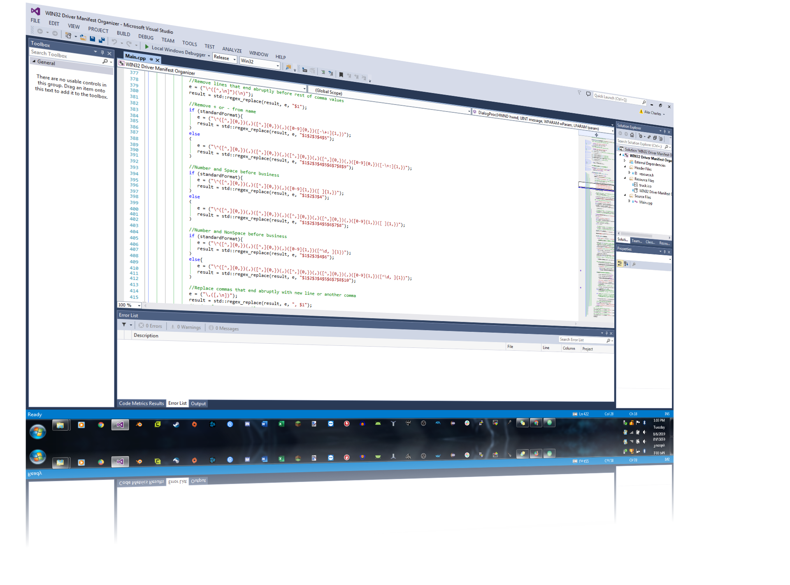

I’m an independent software developer with a Bachelor’s degree in Computer Science. I can write C++, Java, and JavaScript applications, as well as Android apps. I charge $20/hour. References available upon request.

Resume:
https://drive.google.com/open?id=1hBriU7vHjXCdORgUJPVwnXuUrxHgIz5D

## Contact Info
Call or Text at:
### (541) 234-3249
### alexcharles44444@gmail.com

<a href="index.md">Also See my Alex's Computer Repairs page</a>
